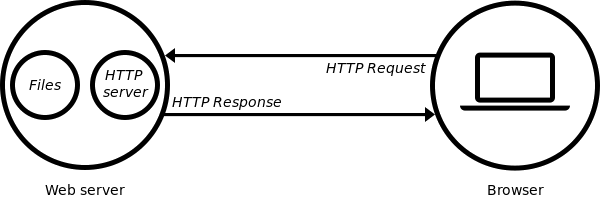
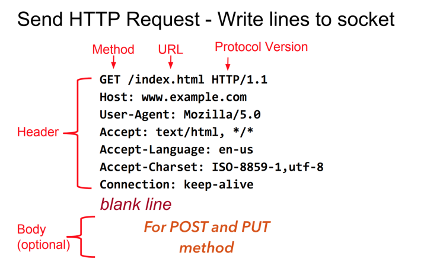
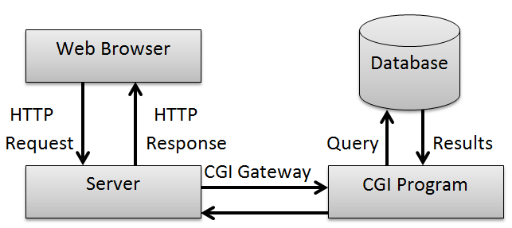

# webserv (42 Project)

This project is about writing HTTP server with c++98.

---

## How to use it

Run the server:

	make && ./webserv [configuration file]

Run the dev test:

	make test && ./webserv_test

<!-- Run the server test: -->

---

## Configuration file format

???

---

## Intro

The primary function of a web server is to store, process and deliver web pages to clients using HTTP.  To use a web server, the client need to send HTTP request (with browser for example), the server find the requested document and send HTTP response with the document needed by the client.



---

## HTTP

HTTP ([Hypertext Transfer Protocol](https://en.wikipedia.org/wiki/Hypertext_Transfer_Protocol)) is an application layer protocol used for access others ressources with [hyperlink](https://en.wikipedia.org/wiki/Hyperlink) easily, for exemple by a mouse click.
HTTP message consist of:
- **A start line**: HTTP request contain the HTTP method, a request target and a string indicate the HTTP version. HTTP response contain the HTTP version of the server, a status code and optionnaly a description of the status code.
- **A header fields**: A list of key value that contain metadata about the HTTP connection and message. Each file is on a single line and have the format ```field_name: field_value```.
- **Body**: Optionnal section of bytes, often present in HTTP response from the server and sometimes in the request. It can have any format.



### HTTP Request

[HTTP request method](https://developer.mozilla.org/en-US/docs/Web/HTTP/Methods) needed in webserv:
- GET: Request a ressource from the server.
- POST: Send data to the server.
- DELETE: Delete a ressource from the server.

Exemple:
```
GET /hello.html HTTP/1.1
Host: 0.0.0.0
Accept-Language: en, vi
```

### HTTP Response

[HTTP response status code](https://en.wikipedia.org/wiki/List_of_HTTP_status_codes):
- 1XX: The request was received, continuing process.
- 2XX: The request was successfully received, understood and accepted.
- 3XX: Further action needs to be taken in order to complete the request.
- 4XX: The request contains bad syntax or cannot be fulfilled.
- 5XX: The server failed to fulfill an apparently valid request.

Exemple:
```
HTTP/1.1 200 OK
Server: Hello
Content-Length: 13
Content-Type: text/plain

Hello, world
```

---

## Socket programming

A typicall HTTP session is composed of three steps:
1. Client and server established a TCP connection stream.
2. The client sent a HTTP request to the server.
3. The server sent the HTTP response to the client.

Then the steps 2 and 3 can be repeated until both client and server decide to close the TCP connection.


Socket allow to open node in device and link two nodes for communicate using recv and sent.

### Functions

- [socket()](https://beej.us/guide/bgnet/html/#socketman): create new socket.
- [bind()](https://beej.us/guide/bgnet/html/#bindman): associate socket with IP and port.
- [listen()](https://beej.us/guide/bgnet/html/#listenman): listen incoming connection.
- [accept()](https://beej.us/guide/bgnet/html/#acceptman): accept connection on listening socket.
- [connect()](https://beej.us/guide/bgnet/html/#connectman): connect a socket to a server.
- [close()](https://beej.us/guide/bgnet/html/#closeman): close socket (fd) descriptor.
- [send()](https://beej.us/guide/bgnet/html/#sendman): send data to the socket.
- [recv()](https://beej.us/guide/bgnet/html/#recvman): receive data from the socket.

### Server

Basic use case of a server is to open socket, bind the socket with his IP and port, listen the connection and accept them. Now the server is able to read/write data with recv and sent.

### Client

The client need to open a socket, connect to the server and he can read/write data from the socket using recv and sent.

### Blocking socket

---

## CGI

CGI ([Common Gateway Interface](https://en.wikipedia.org/wiki/Common_Gateway_Interface)) is an interface that enable web servers to execute scripts. One of the examples of CGI flow is the Web browsers send the forms data to the backend server, and CGI connects to the application program on the web-server and the program response to the web browser. CGI make a server dynamic.



---

## Tools

- [curl](https://curl.se/): Tool for transferring data with URLs.
- [siege](https://linux.die.net/man/1/siege): Stress tester for web servers.

---

## Usefull links

- [Simple HTTP server from scratch](https://trungams.github.io/2020-08-23-a-simple-http-server-from-scratch/)
- [Guide to network programming](https://beej.us/guide/bgnet/)
- [Difference between pipe and socket](https://www.baeldung.com/cs/pipes-vs-sockets)
- [Understand CGI programing](http://www.whizkidtech.redprince.net/cgi-bin/tutorial)
